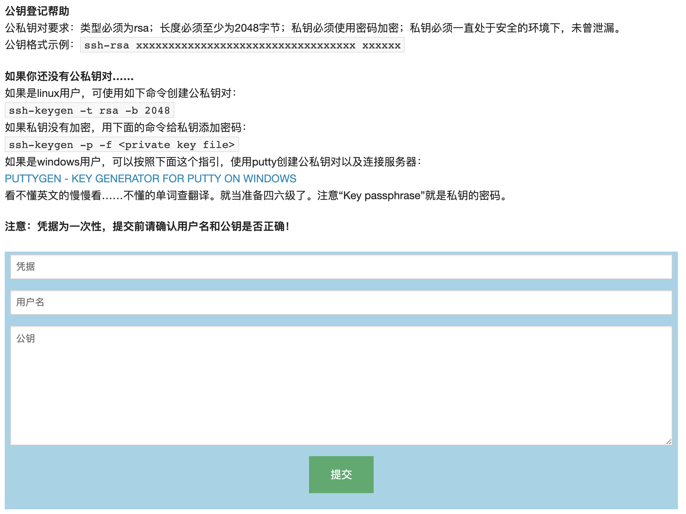

# Server User Manage System - 服务器用户管理系统

## 介绍

这是一个很简单的系统，实现了Linux用户管理的功能。制作这个项目的背景是学校的社团有一台服务器，为了安全，设置成了密钥登录，因此每个人都需要登记一下公钥。管理员手动登记太麻烦，所以写一个自助登记公钥的系统。

## 功能

- 添加用户：创建用户并登记公钥
- 删除用户（TODO）

## 部署

新建目录`/root/sums`，复制`sums`和`index.html`到`/root/sums`。  

复制`sums.service`到`/lib/systemd/system`。  

启动：`systemctl start sums`  

## 使用

可以运行sums查看帮助：

```shell
Usage of ./sums:
  -k string
    	新建凭据的关键词，作用类似密码，访问/api/Keyword就可以生成凭据 (default "Keyword")
  -p string
    	监听的端口号 (default "8000")
```

使用浏览器打开对应端口，就能看到页面。访问对应api可以得到凭据。凭据是一次性的，而且服务重启后就没有了。  
本项目自带的service文件端口号为8000，凭据地址为`/api/NewTicket`。

## 注意事项

需要root权限，故当前部署采用root用户运行。

## 截图


